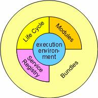

# OSGI框架

> OSGi(Open Service Gateway Initiative)技术是Java动态化模块化系统的一系列规范。OSGi一方面指维护OSGi规范的OSGI官方联盟，另一方面指的是该组织维护的基于Java语言的服务（业务）规范。简单来说，OSGi可以认为是Java平台的模块层。
>
> OSGi服务平台向Java提供服务，这些服务使Java成为软件集成和软件开发的首选环境。Java提供在多个平台支持产品的可移植性。OSGi技术提供允许应用程序使用精炼、可重用和可协作的组件构建的标准化原语，这些组件能够组装进一个应用和部署中。

## 一、框架结构



L0：运行环境

L1：[模块](https://baike.baidu.com/item/模块)

L2：生命周期管理

L3：服务注册 

还有一个无处不在的[安全系统](https://baike.baidu.com/item/安全系统)渗透到所有层。

L0层执行环境是Java环境的规范。Java2配置和子规范，像[J2SE](https://baike.baidu.com/item/J2SE)，CDC，CLDC，[MIDP](https://baike.baidu.com/item/MIDP)等等，都是有效的执行环境。OSGi平台已经标准化了一个执行环境，它是基于基础轮廓和在一个执行环境上确定了最小需求的一个小一些的变种，该执行环境对OSGi组件是有用的。

L1模块层定义类的装载策略。OSGi框架是一个强大的具有严格定义的类装载模型。它基于Java之上，但是增加了模块化。在Java中，正常情况下有一个包含所有类和资源的类路径。OSGi模块层为一个模块增加了私有类同时有可控模块间链接。模块层同安全架构完全集成，可以选择部署到部署[封闭系统](https://baike.baidu.com/item/封闭系统)，防御系统，或者由厂商决定的完全由用户管理的系统。

L2生命周期层增加了能够被动态安装、开启、关闭、更新和[卸载](https://baike.baidu.com/item/卸载)的bundles。这些bundles依赖于于具有类装载功能的模块层，但是增加了在运行时管理这些模块的[API](https://baike.baidu.com/item/API)。生命周期层引入了正常情况下不属于一个应用程序的动态性。扩展依赖机制用于确保环境的操作正确。生命周期操作在安全架构保护之下，使其不受到病毒的攻击。

L3层增加了服务注册。服务注册提供了一个面向bundles的考虑到动态性的协作模型。bundles能通过传统的类共享进行协作，但是类共享同动态安装和卸载代码不兼容。服务注册提供了一个在bundles间分享对象的完整模型。定义了大量的事件来处理服务的注册和删除。这些服务仅仅是能代表任何事物的Java对象。很多服务类似服务器对象，例如HTTP服务器，而另一些服务表示的是一个真实世界的对象，例如附近的一个蓝牙手机。这个服务模块提供了完整安全保障。该服务安全模块使用了一个很聪明的方式来保障bundles之间通信安全。

## 二、系统服务

系统服务提供水平功能，它在每个系统是必须的。日志服务，配置管理服务，设备访问服务，用户管理服务，[IO](https://baike.baidu.com/item/IO)连接器服务和参数服务都是系统服务的一个方面。

- 日志服务(LogService)日志信息，警告，调试或者错误信息通过日志服务来处理的。它接受日志实体并分派这些实体到订阅了这个信息的其他bundles。

- 配置管理服务(ConfigurationAdminService)该服务提供一个设置和获取配置信息的灵活、动态模型。

- 设备访问服务(DeviceAccessService)设备访问是OSGi为一个新的设备匹配一个驱动，并自动下载一个实现该驱动的bundles的机制。这个可用作即插即用方案。

- 用户管理服务(UserAdminService)该服务使用一个用于授权和验证目的的用户信息数据库。

- IO连接器服务(IOConnectorService)该IO连接器服务实现了CDC/CLDCjavax包，并作为一个服务。该服务允许bundles提供新的可交换协议模式。

- 参数服务(PreferencesService)该服务提供了参数层级数据库的可访问性，同Windows注册表或者Java参数类相似。

- 组件运行时服务(ComponentRuntime)服务的动态特性--它们能够在任何时间来去自由--使编写软件变得更难。组建运行时规范通过提供一个基于依赖声明的XML文件来简化处理这些动态方面。

- 部署管理服务(DeploymentAdmin)OSGi的主要部署格式是bundle，它是一个JAR/ZIP文件。部署管理提供第二种可选格式：部署包。部署包能够将bundles和相应资源联接成可被安装和卸载的单个交付。完整的资源处理器模型允许用户代码扩充资源类型。

- 事件管理服务(EventAdmin)很多OSGi事件有特定的类型化的[接口](https://baike.baidu.com/item/接口)，使其很难接收和过滤事件。事件服务提供一个泛化的基于主题的事件机制。这个规范包括为所有已存框架和服务事件的映射。

- 应用程序管理服务(ApplicationAdmin)OSGibundle模型不同于依赖于启动和关闭形式的典型的桌面或者移动电话应用程序模型。该应用程序管理服务提供了传统应用程序模型和它所要求的管理设施。

## 三、OSGI Equinox

> Equinox其实就是OSGi核心标准的完整实现

### 1、下载

链接https://download.eclipse.org/equinox/

### 2、dos启动框架（在sdk环境路径下）

```shell
java -jar org.eclipse.osgi_3.15.100.v20191114-1701.jar -console
```

如果出现osgi>的提示符，说明启动成功

### 3、基本命令

| install [URL]        | 将URL表示的bundle安装到框架中   |
| -------------------- | ------------------------------- |
| uninstall [bundleID] | 将id=bundleID的bundle卸载       |
| start [bundleID]     | 启动一个bundle                  |
| stop [bundleID]      | 停止一个bundle                  |
| refresh [bundleID]   | 刷新bundle                      |
| update [bundleID]    | 更新bundle 的内容               |
| ss                   | 简单显示所有bundle的状态        |
| status               | 展示安装的bundle和注册的服务    |
| headers [bundleID]   | 展示bundle 的manifest中的元数据 |

### 4、Eclipse建立环境

#### 4.1设置

Eclipse的window->preferences界面，选中Plug-in Development下的Target Platform


点击add 》》》


默认设置，点击next 》》》


点击add 》》》


选择Directory


选择你的Equinox的jar包所在路径，然后点击finish，回到上个界面


点击finish


勾选多出来的这个选项，确定！！！

#### 4.2启动

打开菜单项Run->Run configurations，在OSGi Framework项中，新建一个Runconfiguration：


点击run 》》》看到如下视图说明启动成功。


这里输入ss看状态

#### 4.3新建工程

打开新建project的界面，选择Plug-in Project


点击next 》》》


输入工程名，Target Platform选择osgi，点击next 》》》


点击finish

#### 4.4工程资源

见版本库